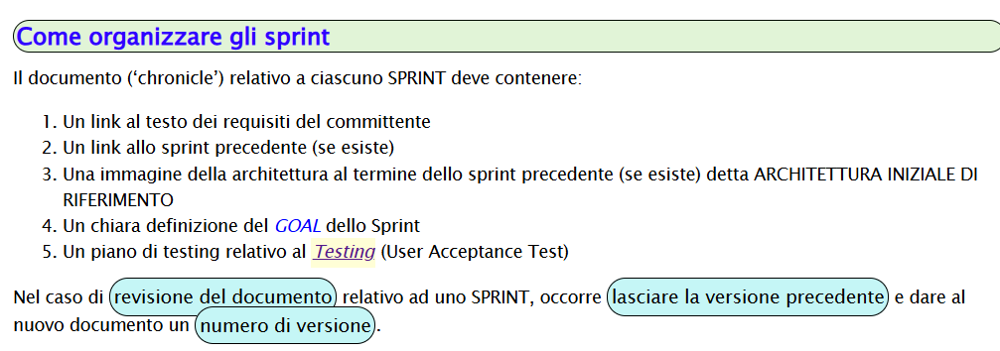

# Chronicle 0

## Goal

## Requisiti
I requisiti richiesti dal committente si possono consultare al seguente link:
[Requisiti del committente](../commons/requirements/requirements.md)

## Vocabolario

## Software fornito dal committente

## Macrocomponenti del sistema

## Numero di nodi computazionali

## Modello

### Perché usare QAK
[Documentazione](../commons/resources/qakDoc)

### Architettura iniziale

## Piano di testing

## Piano di lavoro
