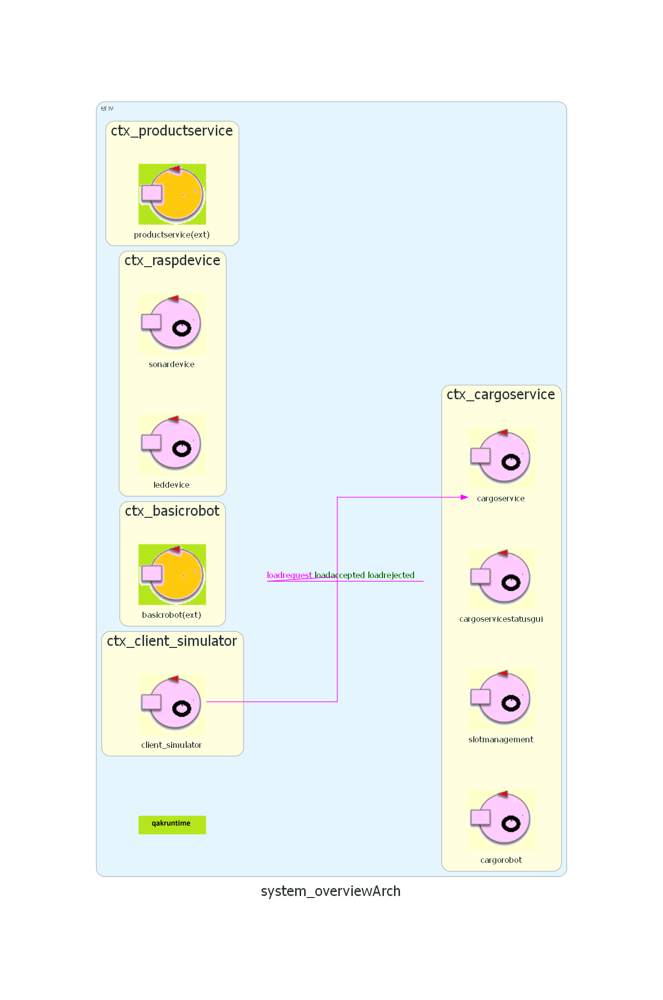

# Chronicle 0

## Goal
L’obiettivo dello sprint0 è analizzare i requisiti forniti dal committente riguardo al TemaFinale25 per chiarire eventuali dubbi ed eliminare ambiguità. Successivamente questi verranno formalizzati attraverso l’uso di componenti software per poi procedere con una prima definizione dell’architettura logica del sistema costituita da macrocomponenti (evidenziabili dai bounded context individuati) e le varie interazioni tra questi. Essendo un sistema complesso andremo ad utilizzare macrocomponenti sia già precedentemente sviluppate che sviluppabili per le nostre esigenze con annesso piano di testing affinché si possano isolare problemi o errori.
Infine sarà necessario sviluppare un piano di lavoro per definire deadline e i successivi sprint.

## Requisiti
I requisiti richiesti dal committente si possono consultare al seguente link:
[Requisiti del committente](../commons/requirements/readme.md)

## Vocabolario
| Termine          | Descrizione |
|------------------|-------------|
| **Compagnia**             | Compagnia di trasporto marittimo che rappresenta il committente del lavoro. |
| **Hold (stiva)**          | Area della nave in cui verranno effettuate le varie operazioni di carico. |
| **Cargorobot**            | Nome attribuito al Differential Drive Robot (DDR) impiegato dal committente per il trasporto dei contenitori nella stiva. |
| **Products (prodotti)**   | Merce che il robot deve caricare sulla nave. |
| **Container (contenitore)** | Dove viene collocato il prodotto prima di essere caricato nella nave. |
| **Productservice**        | Servizio (software) che si occupa di registrare i prodotti e restituire le varie informazioni al cargoservice (es. PID). |
| **PID**                   | Identificatore univoco (Numero naturale > 0) assegnato ad ogni prodotto nel database. |
| **IO-Port**               | Porta d'ingresso/uscita alla stiva, punto di arrivo per i contenitori prima del carico. |
| **Slot**                  | Posizioni di stoccaggio all’interno della hold area contenenti i vari container dei prodotti, hanno una capacità massima. Sono 5 di cui una è permanentemente occupata. |
| **Sonar**                 | Componente concreto (Hardware) dato dal committente con software componente base e posto sulla IO-Port che individua la presenza di un ostacolo, nel nostro caso per individuare un product container. |
| **D**                     | Distanza che rileva il sonar alla presenza di un contenitore. |
| **DFREE**                 | Distanza massima per cui il sistema è in grado di funzionare correttamente. |
| **Cargoservice**          | Sistema software da sviluppare. |
| **MaxLoad**               | Peso (in kg) massimo che può trasportare la nave. |
| **Richiesta**             | Volontà di caricare un prodotto sulla nave. |
| **HOME**                  | Posizione di partenza/ritorno del cargorobot dopo ogni operazione. |
| **Web-gui**               | Interfaccia web grafica dove è possibile mostrare lo stato della hold e delle operazioni. |
| **Led**                   | Componente concreto (Hardware) dato dal committente con software di utilizzo base e in grado di emettere luce nel caso il sonar misuri una distanza maggiore rispetto quella massima di rilevazione. |


## Macrocomponenti del sistema
Per individuare le macrocomponenti del sistema è giusto esaminare e schematizzare i bounded context precedentemente individuati.
Lo scopo della tabella qui sotto riportata è proprio quello di individuare le macrocomponenti rispetto le responsabilità di ogni bounded context.

| Bounded Context            | Macrocomponente     | Responsabilità Principale      |
|----------------------------|---------------------|--------------------------------|
| Gestione Carico            | cargoservice        | Si occupa della logica di business legata al processo di carico, come validazione, assegnazione dello slot, avanzamento del processo di carico |
| Slot Management            | slotmanagement      | Gestisce lo stato fisico della stiva, come tenere traccia degli slot disponibili e occupati, quale prodotto si trova in quale slot, fornire informazioni sull'occupazione della stiva |
| Interazione fisica/sensori | leddevice, sonardevice, cargorobot | Si occupa dell'interfacciamento con i dispositivi fisici, leggendone dati (come nel caso del sonar) o attivandoli per determinare anomalie (come nel caso del led) o determinare una determinata posizione (come nel caso del cargorobot) |
| Visualizzazione Stiva      | cargoservicestatusgui | Gestisce l'interfaccia utente (GUI) per mostrare lo stato corrente della stiva in modo dinamico interrogando i dati rilevanti |
| Product Management         | productservice      | Gestisce il ciclo di vita dei prodotti che possono essere caricati in mare, in particolare fornirà alla gestione del carico il PID del prodotto e attributi rilevanti come il peso |

## Software fornito dal committente
Macrocomponenti da sviluppare:
- cargoservice
- slotmanagement
- cargorobot
- cargoservicestatusgui

Macrocomponenti da non sviluppare perchè fornite dal committente:
- basicrobot
- productservice
- WEnv

Macrocomponenti da sviluppare in parte:
- sonardevice
- leddevice

## Numero di nodi computazionali
Dall'analisi dei requisiti dati dal committente, si è appurato che il sistema dovesse avere al più 4 nodi computazionali, così come si può vedere in figura.
<br>


## Modello

### Perché usare QAK
Qak consente di **modellare, realizzare ed eseguire** sistemi a microservizi in modo coerente, rapido e reattivo, **riducendo l’abstraction gap** e offrendo vantaggi concreti rispetto ai POJO in termini di

* chiarezza strutturale,
* comportamento esplicito,
* gestione della concorrenza,
* interoperabilità.

Per un maggiore approfondimento sulle motivazioni dell'uso di qak si rimanda alla [Documentazione](../commons/resources/qakDoc).

### Architettura iniziale
Di seguito viene riportata l'immagine dell'architettura iniziale, punto di riferimento per lo sprint successivo.
<br>

<div style="text-align: center;">
  
</div>

Si mettono in evidenza le seguenti caratteristiche dell'architettura.

Il sistema è distribuito su almeno 4 nodi computazionali diversi.

La interazione client_simulator-cargoservice è di tipo request-response ed è implicata dal testo dei requsiti.

La interazione sonardevice è modellata come un evento, ma non è un requisito. Dunque potrebbe essere modificata negli sviluppi successivi, mentre potrebbe essere ritenuto un requisito che l’informazione prodotta dal sottosistema su ctx_raspdevice non sia di pertinenza di cargoservice (cosa questa da discutere e da approfondire con il committente).

Risulta invece un requisito architetturale il fatto che il cargoservice ‘non veda’ basicrobot, essendo un componente dato dal committente.


## Piano di testing
[Link al codice](./systemOverview/src/test/java/SystemTest.java)

In questo sprint si formulano dei test generici su servizi mock, al fine di testare il funzionamento delle interazioni individuate tra i macrocomponenti del sistema. 
Nel [modello QAK](./systemOverview/src/system_overview.qak) vengono definite le seguenti richieste e relative risposte: 
```text
    // ClientSimulator -> ProductService
Request registrationrequest:	registrationrequest(Weight)

// ProductService -> ClientSimulator
Reply registrationaccepted: registrationaccepted(PID) for registrationrequest

// ClientSimulator -> CargoService
Request loadrequest:	loadrequest(PID)

// CargoService -> ProductService
Request productdatareq: productdatareq(PID)

// ProductService -> CargoService

Reply productdata: productdata(Weight)
Reply errorproductdata: errorproductdata(M) //PID doesn't exist

// CargoService -> ClientSimulator

Reply loadaccepted:		loadaccepted(Slot) for loadrequest
Reply loadrejected:		loadrejected(M) for loadrequest
```

Vengono quindi definiti dei test per verificare che il servizio restituisca le risposte corrette nelle situazioni descritte dai requisiti. 

* Test di richiesta con PID invalido (<0)
```java
    @Test
    public void testLoadRequestInvalidPID() throws Exception {
        //richiesta con PID invalido
        String req = CommUtils.buildRequest("mock",
                "loadrequest", "load_product(-1)", 
                "cargoservice").toString();
        
        System.out.println("Richiesta: " + req);
        
        String response = conn.request(req);
        
        System.out.println("Risposta: " + response); 
        
        //Verifica che sia stata rifiutata
        assertTrue("Test PID invalido", 
                 response.contains("loadrejected"));
    }
```

* Test di richiesta accettata
```java
    @Test
	public void testLoadRequestAccepted() throws Exception {
		String req = CommUtils.buildRequest("mock",
                "loadrequest", "load_product(1)", 
                "cargoservice").toString();
        
        System.out.println("Richiesta: " + req);
        
        String response = conn.request(req);
        
        System.out.println("Risposta: " + response); 
        
        //Verifica che sia stata accettata
        assertTrue("Test richiesta accettata", 
                response.contains("loadaccepted"));
    }
```
* Test di richiesta rifiutata per peso superiore a ${\color{blue}\texttt{MaxLoad}}$
```java
    @Test
	public void testLoadRequestTooHeavy() throws Exception {
		String req = CommUtils.buildRequest("mock",
                "loadrequest", "load_product(2)", 
                "cargoservice").toString();
        
        System.out.println("Richiesta: " + req);
        
        String response = conn.request(req);
        
        System.out.println("Risposta: " + response); 
        
        //Verifica che sia stata rifiutata per il peso
        assertTrue("Test troppo pesante", 
                response.contains("loadrejected") && 
                response.contains("too_heavy"));
    }
```
* Test di richiesta rifiutata per mancanza di slot liberi
```java
    @Test
	public void testLoadRequestNoFreeSlots() throws Exception {
			// si faccia setup con slot pieni es. accettando preventivamente 4 richieste
		String req = CommUtils.buildRequest("mock",
                "loadrequest", "load_product(3)", 
                "cargoservice").toString();
        
        System.out.println("Richiesta: " + req);
        
        String response = conn.request(req);
        
        System.out.println("Risposta: " + response); 
        
        //Verifica che sia stata rifiutata per mancanza di slot liberi
        assertTrue("Test slot pieni", 
                response.contains("loadrejected") && 
                response.contains("no_slots"));
    }
```


## Piano di lavoro

Al termine di questo sprint 0 abbiamo ritenuto opportuno suddividere il resto del progetto in 3 sprint, ognuno dei quali sarà dedicato a soddisfare un sottoinsieme specifico dei requisiti dati dal committente, ovvero a implementare un sottoinsieme dei macrocomponenti individuati in questa fase. Nello specifico:
| Sprint | Componenti da sviluppare | Tempo stimato |
|--------|--------------------------|---------------|
| Sprint 1 | ```cargoservice```, ```cargorobot``` | 36 |
| Sprint 2 | ```sonardevice```, ```slotmanagement``` | 30 |
| Sprint 3 | ```cargoservicestatusgui```, ```leddevice``` | 24 |

I tempi riportati (in ore uomo) sono da considerarsi indicativi e sono stati ricavati da una stima basata sul tempo impiegato per lo sprint 0.
