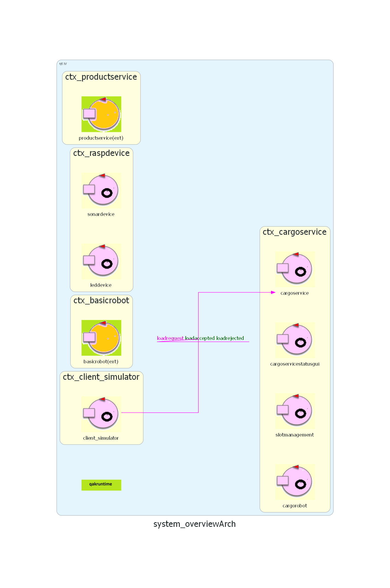
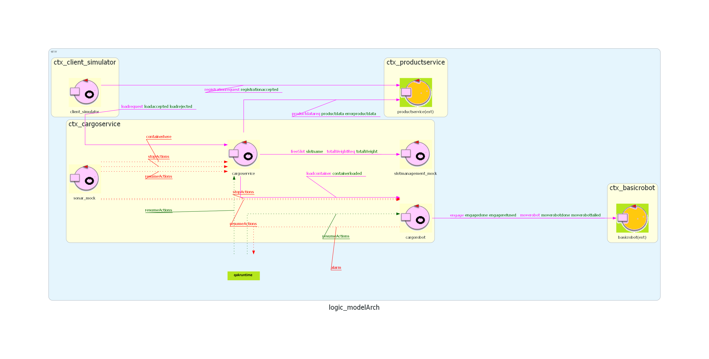
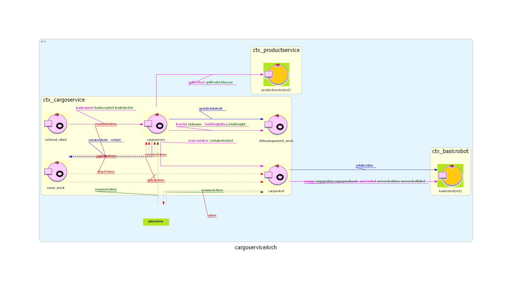

# Sprint 1

## Architettura iniziale dello sprint


## Obiettivi

Come concordato nello sprint precedente, l’obiettivo di questo sprint è lo sviluppo dei componenti ```cargoservice``` e ```cargorobot```, in modo da soddisfare i requisiti a essi associati. Prima di procedere con l’implementazione, verrà effettuata un’attenta analisi del problema e una fase di progettazione di ciascun componente. In particolare i requisiti su cui ci concentreremo in questo sprint sono:

> The software system:
>
> 1\. **Receives a request to load** on the cargo a product container already registered in the ${\color{blue}\text{productservice}}$.
>
>   The request is rejected when:
>
>   a. the product weight is evaluated too high, since the ship can carry a maximum load of
>     ${\color{blue}\texttt{MaxLoad > 0 kg}}$
>
>   b. the hold is already full, i.e., the
>     ${\color{lightblue}\texttt{4 slots}}$ are already occupied.
>
>   If the request is accepted, the ${\color{blue}\text{cargoservice}}$ associates a slot to the product
>   ${\color{blue}\texttt{PID}}$ and returns the name of the reserved slot.
>   Afterwards, it waits for the product container to be delivered to the ${\color{blue}\text{ioport}}$.
>   In the meantime, other requests are not elaborated.
>
> 3\. Ensures that the product container is placed by the ${\color{blue}\text{cargorobot}}$ within its reserved slot.
>   At the end of the operation:
>
>   * the ${\color{blue}\text{cargorobot}}$ should return to its ${\color{brown}\text{HOME}}$ location;
>   * the ${\color{blue}\text{cargoservice}}$ can process another *load-request*
>
> 5\. ${\color{brown}\text{Interrupts}}$ any activity and turns on a LED if the ${\color{blue}\text{sonar sensor}}$ measures a distance
>   $D > D_{FREE}$ for at least \$3\$ seconds (possibly a sonar failure).
>   The service continues its activities as soon as the sonar measures a distance $D \leq D_{FREE}$

Abbiamo deciso di mantenere i requisiti originali in inglese per non correre il rischio di alterarne il significato, tuttavia è necessario specificare che i punti 1 e 5 verranno sviluppati parzialmente appoggiandoci a componenti mock per ```slotmanagement```, ```sonardevice``` e ```leddevice``` che verranno implementati in seguito. 

## Analisi del problema

### Cargoservice
Cargoservice è il componente principale del sistema e avrà il compito di interagire con ogni altra componente affinchè le operazioni da eseguire seguano il giusto ordine e flusso. Essendo, dunque, un componente reattivo e proattivo lo andremo a considerare come attore.

Flusso di operazioni di cargoservice:

**Requisito 1**
- riceve una request per il carico di un prodotto (```loadrequest```)
- nel caso in cui ci siano richieste successive vengono accodate finchè la richiesta presa in carico non è stata gestita (come di seguito specificato)
- legge il PID dal corpo della ```loadrequest```
- interroga ```slotmanagement``` per sapere se c'è uno slot libero e quale (**)
    - se risposta positiva, ```slotmanagement``` manda il nome dello slot libero e si va avanti
    - se risposta negativa, si rifiuta la request (```loadrejected```)
- interroghiamo ```productservice``` sull'esistenza di questo PID
  - se risposta negativa, ovvero errore, messaggio di errore
  - se risposta positiva il ```productservice``` ci manda i dati del prodotto, in particolare il peso (*)
- viene interrogato ```slotmanagement``` sul peso totale in hold
- ricevuta risposta controllo che l'aggiunta del peso del nuovo prodotto rimanga entro i limiti di ${\color{blue}\texttt{MaxLoad}}$
  - se il controllo va a buon fine viene accettata la richiesta (```loadaccepted(SLOT)```)
  - se il controllo fallisce la request è rifiutata, ovvero viene propagato un messaggio di errore (```loadrejected```)
- una volta accettata la richiesta, attende di essere notificato della presenza del container
- invia a ```cargorobot``` l'istruzione di caricare il container, fornendogli il nome dello slot assegnato
- attende il completamento della richiesta (riceve da ```cargorobot``` la comunicazione di raggiungimento della HOME, ```containerloaded```)
- ricevuta la risposta che ```cargorobot``` è tornato ad HOME, ```cargoservice``` avviserà ```slotmanagement``` di aggiornare i dati della stiva salvandosi il PID del prodotto che è andato nello slot libero (```updatedatahold```)
- Da questo momento ```cargoservice``` può gestire una nuova richiesta
 
(*) nel caso in cui ci fosse in futuro l'opportunità di dover chiedere altre informazioni del prodotto e non solo il peso, rispetta il principio aperto/chiuso
(**) Abbiamo deciso di verificare prima la presenza di slot liberi per evitare una chiamata superflua al db
 I messaggi che si scambiano ```cargoservice``` e ```productservice``` sono i seguenti:
```
// CargoService -> ProductService
Request getProduct         : product( PID ) 

 // ProductService ->
Reply   getProductAnswer: product( JSonString ) for getProduct
```
Ci appoggiamo alla classe ```Product.java``` fornita dal committente per gestire la risposta in formato JSon.

Per quanto riguarda il requisito 3 di verifica della corretta esecuzione della richiesta di carico, dal confronto col committente è emerso che questa è già garantita poiché gli ostacoli nella mappa sono fissi, dunque il robot potrebbe incontrare un ostacolo solo se 
si muove "a caso" e non secondo un path pianficato in precedenza.


Si necessita di un evento affinchè ```cargoservice``` sappia quando un container si trova davanti a I/O port:
```
Event containerhere : containerhere(M)
```

Dovendo gestire diverse situazioni di fallimento, abbiamo ritenuto opportuna l'introduzione di diverse cause di messaggio rifiutato, in particolare:
- ```too_heavy```
- ```no_slots```
- ```no_PID```

**Requisito 5**
- gestione dell'interruzione di ogni attività del sistema attraverso evento
- gestione evento di ripristino delle attività dopo un'interruzione

Sarà necessario aggiungere al modello due messaggi per gestire questi eventi:
```
Event stopActions : stopActions(M)
Event resumeActions : resumeActions(M)
```

Poiché gli eventi andrebbero propagati a ```cargorobot```, decidiamo di fare una subscribe dell'intero contesto ```ctx_cargoservice```.

Per completezza si aggiungono anche i messaggi tra ```client_simulator``` e ```productservice``` in fase di registrazione:
```
// ClientSimulator -> ProductService
Request registrationrequest:	registrationrequest(Weight)

// ProductService -> ClientSimulator
Reply registrationaccepted: registrationaccepted(PID) for registrationrequest
```

In fase di prima modellazione abbiamo deciso di scrivere anche i messaggi tra ```cargoservice``` e ```slotmanagement``` anche se ci riserviamo in un secondo momoento di rendere l'entità ```slotmanagement``` statica.
```
// CargoService -> SlotManagement
Request freeSlot : freeSlot(M)
Request totalWeightReq: totalWeightReq(M)
// SlotManagement -> CargoService

Reply slotname : slotname(Slot) for freeSlot // Slot = SlotN or NONE
Reply totalWeight : totalWeight(Weight) for totalWeightReq
```

### Cargorobot
```cargorobot``` è il componente che si occupa di portare un container nello slot specificato dal ```cargoservice```. Essendo anch'esso un componente reattivo e proattivo lo andremo a considerare come attore, analogamente al ```cargoservice```.

A questo punto si presenta la necessità di stabilire se e come il robot sappia "orientarsi". Da un lato, potrebbe essere ```cargoservice``` a mantenere la mappa dell'area e indicare al robot passo passo come muoversi, dall'altro ```cargorobot``` può essere inizializzato per conoscere la posizione degli slot e i loro nomi ed essere in grado di raggiungerli in autonomia. Un'ulteriore opzione sarebbe quella di costruire dinamicamente la mappa in fase di inizializzazione facendola percorrere al robot, ma rimarrebbe la problematica di riconoscere il nome di ogni slot.

Scegliamo la seconda opzione (l'inizializzazione statica della mappa) per semplicità, riservandoci di cambiare approccio in futuro, ad esempio in caso in cui la disposizione della stiva cambi di frequente. Inizializziamo il ```cargorobot``` con la mappa salvata su un file di configurazione a parte.

Flusso di operazioni di ```cargorobot```:
- Inizializzazione di ```cargorobot``` con salvataggio della mappa della stiva e memorizzazione della posizione degli slot associata ai loro nomi

Poi, ciclicamente per ogni richiesta:
- Richiesta di ```engage``` da parte di ```cargorobot``` a ```basicrobot```
- In caso di rifiuto della richiesta, verrà nuovamente fatta la richiesta di ```engage```
- In caso di successo della richiesta, quando riceve una richiesta di carico, il ```cargorobot``` comunica al ```basicrobot``` di raggiungere la I/O port
- Comunica al ```basicrobot``` di prelevare il container
- Dà al ```basicrobot``` le indicazioni per raggiungere lo slot assegnato
- Per la considerazione fatta in precedenza, nel caso in cui il ```basicrobot``` non dovesse finire tutte le istruzioni a lui fornite, l'idea è che torni all'I/O port e riesegua tutte le istruzioni
- Poi il ```cargorobot``` comunica al ```basicrobot``` di rilasciare il prodotto e gli dà le indicazioni per tornare alla HOME
- Terminate queste istruzioni, comunica al ```cargoservice``` che l'esecuzione della richiesta è terminata

N.B. Parliamo già, ad esempio, di richiesta di ```engage``` nonostante non sia nei requisiti in quanto si è andati a studiare il software fornito dal committente.
<!--In caso di ricezione di evento di interrupt, decidiamo per semplicità di far tornare il robot alla HOME e salvare lo slot verso cui era diretto. Al momento di ricezione dell'evento di ripristino, il cargorobot ricomincerà a dare le indicazioni dall'inizio al basicrobot.
$\color{red}\text{Sarà necessario chiedere conferma al committente che questa soluzione non sia in conflitto con i requisiti.}$-->

Notiamo la necessità di aggiungere al modello i seguenti messaggi:
```
//CargoService -> CargoRobot
Request loadcontainer:		loadcontainer(Slot)

// CargoRobot -> CargoService
Reply containerloaded : containerloaded(M) for loadcontainer

// CargoRobot -> BasicRobot
Event alarm: 		alarm(STOP) // to stop basicRobot

Request engage : engage(CALLER)
Reply engagedone : engagedone(ARG) for engage
Reply engagerefused : engagerefused(ARG) for engage

Request moverobot    :  moverobot(TARGETX, TARGETY)
Reply moverobotdone  :  moverobotok(ARG)                    for moverobot
Reply moverobotfailed:  moverobotfailed(PLANDONE, PLANTODO) for moverobot
```

### Modello
Per chiarezza inseriamo un link per il modello. [Modello QAK](./logicModel/src/logicModel.qak)


## Piano di testing
Poiché nell'analisi del problema abbiamo definito le cause specifiche di rifiuto della richiesta da parte di 
```cargoservice```, abbiamo ritenuto opportuno modificare il seguente test aggiungendo il controllo sulla causa di rifiuto:
* Test di richiesta con PID invalido (<0)
```java
    @Test
    public void testLoadRequestInvalidPID() throws Exception {
        //richiesta con PID invalido
        String req = CommUtils.buildRequest("mock",
                "loadrequest", "load_product(-1)", 
                "cargoservice").toString();
        
        System.out.println("Richiesta: " + req);
        
        String response = conn.request(req);
        
        System.out.println("Risposta: " + response); 
        
        //Verifica che sia stata rifiutata
        assertTrue("Test PID invalido", 
                 response.contains("loadrejected"))&&
                response.contains("no_PID");
    }
```

Per il momento risulta difficile individuare altri test in quanto utilizzando software del committente per ```basicrobot``` il suo stato non è direttamente verificabile, ci riserviamo aggiunte nella fase di progettazione dopo un riscontro con il committente.

## Nuova Architettura
In seguito, la nuova architettura alla fine dell'analisi del problema, ci riserviamo la possibilità di cambiamenti a seguito della progettazione dell'attuale sprint. 


<!---->

## Progettazione

Grazie alla modellazione tramite QAK è stato possibile avere uno scheletro del sistema da implementare, a cui sono state semplicemente aggiunte alcune variabili globali per la gestione della logica di business. 

La mappa della stiva che ci è stata fornita dal committente è stata tradotta in formato json:

```json
{
  "Home": { "x": 0, "y": 0, "direction":"s" },
  "SlotsObstacles": [
    { "name": "SlotObstacle1", "x": 2, "y": 1 , "direction":"r" },
    { "name": "SlotObstacle2", "x": 3, "y": 1, "direction":"l" },
    { "name": "SlotObstacle3", "x": 2, "y": 3, "direction":"r" },
    { "name": "SlotObstacle4", "x": 3, "y": 3, "direction":"l" }
  ],
  "LaydownPositions": [
    { "name": "Slot1", "x": 1, "y": 1, "direction":"r" },
    { "name": "Slot2", "x": 1, "y": 3, "direction":"r" },
    { "name": "Slot3", "x": 4, "y": 1, "direction":"l" },
    { "name": "Slot4", "x": 4, "y": 3, "direction":"l" }
  ],
  "IoPort": { "x": 0, "y": 5, "direction":"s" },
  "PickupContainerPosition": { "x": 0, "y": 4, "direction":"s" }
}

```
Ci siamo rese conto che avevamo bisogno di definire ulteriori coordinate per identificare i luoghi in cui si deve spostare il robot.

Abbiamo utilizzato un pojo per leggere il file json e rendere le coordinate facilmente fruibili a cargorobot.
```java
    public class MapService {
		//Map of map Object -> map of its coordinates "x" ->0 "y" ->0
    private final Map<String, MapLocation> lookupMap = new HashMap<>();

    public MapService(String jsonFilePath) throws IOException {
        String content = Files.readString(Paths.get(jsonFilePath));
        JsonObject jsonData = JsonParser.parseString(content).getAsJsonObject();

        // Carica Home
        lookupMap.put("Home", extractCoords(jsonData.getAsJsonObject("Home")));
        // Carica IoPort e PickupContainerPosition
        lookupMap.put("IO", extractCoords(jsonData.getAsJsonObject("IoPort")));
        lookupMap.put("Pickup", extractCoords(jsonData.getAsJsonObject("PickupContainerPosition")));

        // Carica SlotObstacles 
        //real positiones of the slots
        for (JsonElement e : jsonData.getAsJsonArray("SlotsObstacles")) {
            JsonObject obj = e.getAsJsonObject();
            lookupMap.put(obj.get("name").getAsString(), extractCoords(obj));
        }

        // Carica LaydownPositions
        //we name them as "Slot1", "Slot2", etc.
        // This is a list of positions where the robot can lay down containers
        for (JsonElement e : jsonData.getAsJsonArray("LaydownPositions")) {
            JsonObject obj = e.getAsJsonObject();
            lookupMap.put(obj.get("name").getAsString(), extractCoords(obj));
        }
    }

    public MapLocation getCoordinates(String name) {
        return lookupMap.get(name);
    }

    private MapLocation extractCoords(JsonObject obj) {
        
    	Map<String, Integer> coords = new HashMap<>();
        coords.put("x", obj.get("x").getAsInt());
        coords.put("y", obj.get("y").getAsInt());
        Aril dir = Aril.valueOf(obj.get("direction").getAsString());
        MapLocation loc = new MapLocation(coords, dir);
        return loc;
    }
    
 ```
Infine, seguendo il pattern Singleton, è stata creata una classe che restituisce un'istanza di MapService  

```java
    public class MapServiceSingleton {
    private static MapService instance;

    public static void init(String jsonPath) throws IOException {
        if (instance == null) {
            instance = new MapService(jsonPath);
        }
    }

    public static MapService getInstance() {
        return instance;
    }
}
```

Questa viene utilizzata all'interno di cargotobot nel seguente modo:

```
	import "main.java.map*"
		//init map
		[#
			MapServiceSingleton.init("map.json");
			var Map = MapServiceSingleton.getInstance()

			// Home Coordinates
			var HomeLoc = Map.getCoordinates("Home");
			var Homecoords = HomeLoc.getCoords();
			var Home_X = Homecoords.get("x");
			var Home_Y = Homecoords.get("y");
			var Homedir = HomeLoc.getFacingDir()
        #]

```

## Architettura finale Sprint1
Al seguito della progettazione l'architetture definitiva dello Sprint è la seguente.




## Deployment

1. Andare nella cartella ```Sprint1/Implementation```
2. Eseguire il comando ```docker load -i basicrobot24.tar``` per caricare l'immagine Docker del basicrobot
3. Creare la rete ```docker network create iss-network```
4. Eseguire  il comando ```docker compose -f arch1.yaml up``` per far partire vari componenti del sistema (cargorobot, productservice)
5. Aprire il browser su ```localhost:8090``` per visualizzare l’ambiente WEnv in cui lavorerà il DDR robot
7. Eseguire il comando ```./gradlew run``` oppure ```gradle run``` per far partire il resto del sistema cargoservice

*Note:*

a. Per far eseguire il punto 2 è bene ricordarsi di far partire il demone Docker </br>
b. Il sistema cargoservice si appoggia a productservice che ha un database Mongo per la persistenza dei prodotti, questo è già stato riempito con opportuni prodotti di test attraverso il file ```setup_mongo.js```


