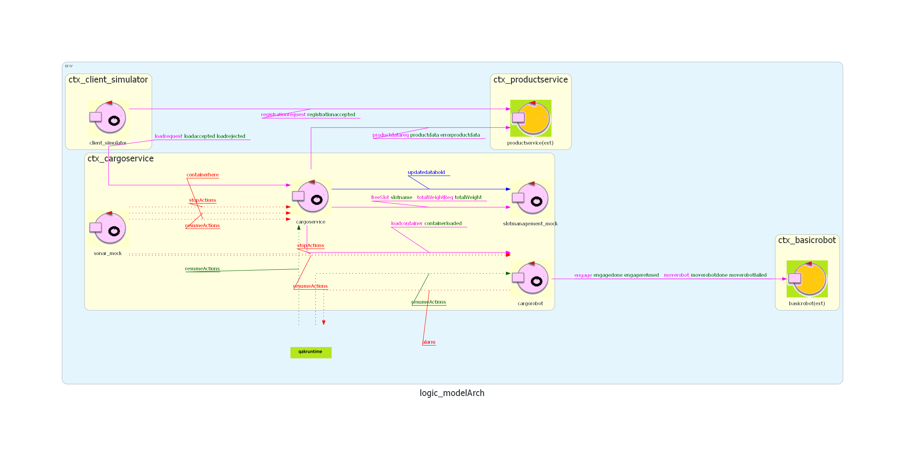

# Sprint2

## Architettura iniziale dello sprint


## Obiettivi

Come concordato negli sprint precedenti, l’obiettivo di questo sprint è lo sviluppo dei componenti ```sonardevice``` e ```slotmanagement```, in modo da soddisfare i requisiti a essi associati. Prima di procedere con l’implementazione, verrà effettuata un’attenta analisi del problema e una fase di progettazione di ciascun componente. In particolare i requisiti su cui ci concentreremo in questo sprint sono:

>  The sensor:
>  * The ${\color{magenta}\text{sensor}}$ put in front of the ${\color{blue}\text{IOPort}}$ is a sonar used to detect the presence of a product container, when it measures a distance  ${\color{blue}\texttt{D}}$, such that  ${\color{blue}\texttt{D < DFREE/2}}$, during a reasonable time (e.g.  ${\color{blue}\texttt{3}}$ secs).
>    
>   2\. Detects (by means of the ${\color{blue}\text{sonar}}$ ${\color{magenta}\text{sensor}}$) the presence of the product container at the ${\color{blue}\text{ioport}}$.
>
>   5\. ${\color{brown}\text{Interrupts}}$ any activity and turns on a LED if the ${\color{blue}\text{sonar sensor}}$ measures a distance
   $D > D_{FREE}$
   for at least \$3\$ seconds (possibly a sonar failure).
   The service continues its activities as soon as the sonar measures a distance
   $D \leq D_{FREE}$


Abbiamo deciso di mantenere i requisiti originali in inglese per non correre il rischio di alterarne il significato, tuttavia è necessario specificare che il punto 5 verrà sviluppato parzialmente appoggiandoci a un componente mock per ```leddevice``` che verrà implementato in seguito. 

## Analisi del problema

### sonardevice
Il sensore sonar deve essere in grado di effettuare misurazioni per la rilevazione di container o malfunzionamenti. Essendo, dunque, un componente reattivo e proattivo lo andremo a considerare come attore.

Flusso di operazioni di sonardevice:
- nella fase di inizializzazione il ```sonardevice``` attiva il sensore fisico
- il sonar continuamente effettua misurazioni, se per 3 secondi la misurazione è consistente (ovvero non cambai significativamente rispetto un margine di errore, da valutare in base all'hardware fornito dal committente) essa viene valutata da ```sonardevice``` nelle seguenti casistiche:
<br>
1. 0 <= D < D_{FREE}/2 -> un container è arrivato alla IO-port dunque il sonardevice dovrà mandare un evento (```containerhere```) per avvisarne la presenza
2. D > D_{FREE} -> è avvenuto un malfunzionamento del sistema, dunque ```sonardevice``` dovrà mandare un evento (```stopActions```) per interrompere le attività di tutto il sistema. In questo caso ```sonardevice``` aspetta una misurazione D <= D_{FREE} per sbloccare il sistema (```resumeActions```) ignorando le altre casistiche


Formalizziamo i messaggi sopraccitati che erano già stati introdotti nel sistema dello Sprint1 per la realizzazione di ```sonar_mock```.

```
  Event stopActions : stopActions(M)
  Event resumeActions : resumeActions(M)
  Event containerhere : containerhere(M)

```

Analizzando il flusso di ```sonardevice```abbiamo appurato che per mantenere al meglio il principio di single responsability sia opportuno dividere i compiti di ```sonardevice```in due attori distinti, uno che si occupi delle misurazioni vere e proprie controllando il sensore fisico e uno che si occupi del processamento di tali misurazioni.

<!--d < dfree/2 -> container
d <= dfree -> torna dal malfunzionamento
d > dfree -> mafunzionamento-->


### slotmanagement


### Modello


## Piano di testing


## Nuova Architettura


## Progettazione


## Deployment

