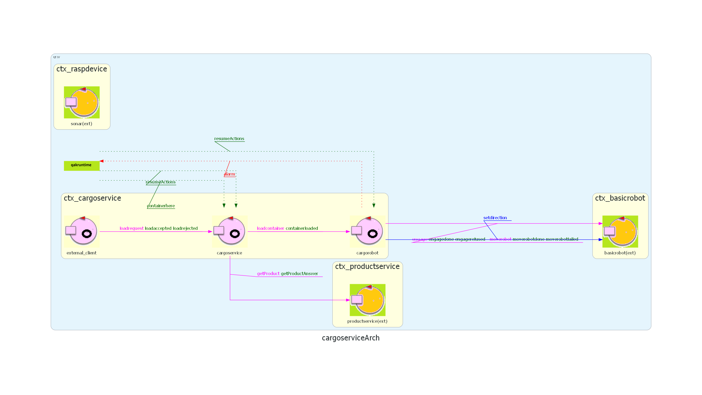

# Sprint2

## Architettura iniziale dello sprint


## Obiettivi

Come concordato negli sprint precedenti, l’obiettivo di questo sprint è lo sviluppo dei componenti ```sonardevice``` e ```slotmanagement```, in modo da soddisfare i requisiti a essi associati. Prima di procedere con l’implementazione, verrà effettuata un’attenta analisi del problema e una fase di progettazione di ciascun componente. In particolare i requisiti su cui ci concentreremo in questo sprint sono:

>  The sensor:
>  * The ${\color{magenta}\text{sensor}}$ put in front of the ${\color{blue}\text{IOPort}}$ is a sonar used to detect the presence of a product container, when it measures a distance  ${\color{blue}\texttt{D}}$, such that  ${\color{blue}\texttt{D < DFREE/2}}$, during a reasonable time (e.g.  ${\color{blue}\texttt{3}}$ secs).
>    
>   2\. Detects (by means of the ${\color{blue}\text{sonar}}$ ${\color{magenta}\text{sensor}}$) the presence of the product container at the ${\color{blue}\text{ioport}}$.
>
>   5\. ${\color{brown}\text{Interrupts}}$ any activity and turns on a LED if the ${\color{blue}\text{sonar sensor}}$ measures a distance
   $D > D_{FREE}$
   for at least \$3\$ seconds (possibly a sonar failure).
   The service continues its activities as soon as the sonar measures a distance
   $D \leq D_{FREE}$


Abbiamo deciso di mantenere i requisiti originali in inglese per non correre il rischio di alterarne il significato, tuttavia è necessario specificare che il punto 5 verrà sviluppato parzialmente appoggiandoci a un componente mock per ```leddevice``` che verrà implementato in seguito. 

## Analisi del problema

### sonardevice
Il ```sonardevice``` deve essere in grado di effettuare misurazioni per la rilevazione di container o malfunzionamenti. Essendo, dunque, un componente **reattivo** e **proattivo** lo andremo a considerare come attore.

Flusso di operazioni di sonardevice:
- nella fase di inizializzazione il ```sonardevice``` attiva il sensore fisico
- il sonar continuamente effettua misurazioni, se per 3 secondi la misurazione è consistente (ovvero non cambai significativamente rispetto un margine di errore, da valutare in base all'hardware fornito dal committente) essa viene valutata da ```sonardevice``` nelle seguenti casistiche:


1. 0 <= D < D_{FREE}/2 -> un container è arrivato alla IO-port dunque il sonardevice dovrà mandare un evento (```containerhere```) per avvisarne la presenza
2. D > D_{FREE} -> è avvenuto un malfunzionamento del sistema, dunque ```sonardevice``` dovrà mandare un evento (```stopActions```) per interrompere le attività di tutto il sistema. In questo caso ```sonardevice``` aspetta una misurazione D <= D_{FREE} per sbloccare il sistema (```resumeActions```) ignorando le altre casistiche


Formalizziamo i messaggi sopraccitati che erano già stati introdotti nel sistema dello Sprint1 per la realizzazione di ```sonar_mock```.

```
  Event stopActions : stopActions(M)
  Event resumeActions : resumeActions(M)
  Event containerhere : containerhere(M)

```

Analizzando il flusso di ```sonardevice```abbiamo appurato che per mantenere al meglio il principio di single responsability sia opportuno dividere i compiti di ```sonardevice```in due attori distinti, uno che si occupi delle misurazioni vere e proprie controllando il sensore fisico e uno che si occupi del processamento di tali misurazioni.

<!--d < dfree/2 -> container
d <= dfree -> torna dal malfunzionamento
d > dfree -> mafunzionamento-->


### slotmanagement

In fase di prima modellazione, negli Sprint precedenti, avevamo rappresentato ```slotmanagement``` come un attore autonomo, poiché responsabile della gestione degli slot e del calcolo del peso in stiva. Tuttavia, durante la fase di progettazione di ```slotmanagement_mock```, ci siamo rese conto che ```slotmanagement``` non ha comportamenti autonomi né la necessità di reagire ad eventi in modo asincrono.

Abbiamo quindi deciso di refattorizzare ```slotmanagement``` come POJO, ovvero un componente passivo accessibile come oggetto Java semplice, gestito direttamente da cargoservice.

Tale cambiamento è giustificato da:

- l’assenza di stato interno reattivo o concorrenza;

- la necessità di mantenere semplice l’architettura;

- il principio You Aren’t Gonna Need It (YAGNI).

Flusso di operazioni di slotmanagement:
- In fase di inizializzazione ```slotmanagement``` Inizializza gli slot e azzera il peso totale all'interno della stiva (```TotalWeight```).(*)
- Quando ```CargoService``` chiede se ci sono slot disponibili riceve risposta da ```slotmanagement``` (```freeSlot```)
- Quando ```CargoService``` chiede il peso totale della stiva viene calcolato e mandato (```totalWeightReq```)
- Quando ```CargoService``` manda una richiesta di aggiornamento della Stiva ```slotmanagement``` cambia il suo stato interno di conseguenza (```updateHold(Product,SlotName)```)
- Quando ```CargoService``` chiede lo stato della stiva questo venga mandato (```getHoldState()```)

Si noti come anche nel flusso di operazioni ```slotmanagement``` assume solo comportamenti passivi, giustificando maggiormente la nostra scelta di renderlo un componente POJO.


*NOTE* : <br>
(*) in futuro potrebbe caricare direttamente lo stato della stiva desiderato attraverso un file di configurazione.
Per rendere più agevole questo passaggio verrà implementata un'interfaccia [FORSE DA METTERE IN IMPLEMENTAZIONE]


### Modello
L'analisi confluisce nei seguenti 2 modelli logici.





## Piano di testing


## Progettazione

Sulla base dell'analisi effettuata, si procede alla progettazione dettagliata dei componenti.

### sonardevice: un'Architettura a Due Attori

Come emerso dall'analisi, per rispettare il **Principio di Singola Responsabilità (SRP)**, la logica del `sonardevice` viene suddivisa in due attori distinti, entrambi operanti nel contesto `ctx_raspdevice`:

1.  **`sonardevice` (Il Lettore)**: Questo attore ha un unico e specifico compito: interfacciarsi con l'hardware. La sua responsabilità è leggere i dati grezzi dal sensore fisico (tramite lo script `sonar.py` fornito dal committente), effettuare un primo, semplice filtraggio (es. scartare valori palesemente errati) e pubblicare i dati validi in un flusso locale.
    *   **Scelta Progettuale**: L'uso della primitiva Qak `emitlocalstream` è fondamentale. Questa scelta garantisce che i dati grezzi del sensore vengano trasmessi in modo efficiente e **solo agli attori locali** (nello stesso contesto) che si sono esplicitamente sottoscritti. Questo disaccoppia il lettore hardware dall'elaboratore della logica, permettendo di modificare o sostituire uno dei due senza impattare l'altro.

2.  **`mind` (L'Elaboratore)**: Questo attore rappresenta la "mente" del sistema di rilevamento. Si sottoscrive allo stream di dati generato da `sonardevice` e contiene tutta la logica di business per interpretare tali dati.
    *   **Scelta Progettuale (Automa a Stati Finiti)**: Il comportamento del `mind` è modellato come un **Automa a Stati Finiti (FSM)**, una delle caratteristiche principali del DSL Qak. Questa scelta è ideale perché il sistema ha comportamenti nettamente diversi a seconda del suo stato interno (operativo normale o in fault).
        *   **Stato `work`**: Modella il comportamento standard del sistema. Qui, l'attore analizza la sequenza di misurazioni per rilevare la presenza di un container.
        *   **Stato `fault_state`**: Modella il comportamento anomalo. Una volta entrato in questo stato, la logica di valutazione dei dati cambia radicalmente: l'attore non cerca più container, ma attende unicamente una sequenza di misurazioni che indichino che il guasto è stato risolto, ignorando tutto il resto. L'uso di uno stato esplicito per il fault rende il modello più leggibile, robusto e facile da debuggare rispetto a una gestione basata unicamente su variabili booleane complesse.
    *   **Gestione della Consistenza**: La logica del "rilevamento per 3 secondi" viene implementata tramite un contatore di misurazioni consecutive all'interno dello stesso intervallo di distanza. Questo approccio è robusto contro letture anomale sporadiche e assicura che un evento venga emesso solo a fronte di una situazione stabile.

### Comunicazione tra Componenti: il Ruolo degli Eventi e di MQTT

La comunicazione verso gli altri componenti del sistema, come `cargoservice` e il `cargorobot`, deve essere flessibile e disaccoppiata.

*   **Scelta Progettuale (Eventi Globali)**: Invece di una comunicazione punto-punto (`Dispatch`), o con la modellazione come eventi locali fatta in precedenza, ma non più possibile, abbiamo scelto di usare gli **Eventi** (`containerhere`, `stopActions`, `resumeActions`). Questa decisione è motivata dalla necessità di una comunicazione **uno-a-molti**. Il `mind` non ha bisogno di conoscere quali e quanti attori sono interessati alle sue notifiche; semplicemente "annuncia" un accadimento significativo al sistema. Qualsiasi componente, presente o futuro, può sottoscriversi a questi eventi senza richiedere alcuna modifica all'attore `mind`. Questo garantisce alta manutenibilità e scalabilità.

*   **Scelta Progettuale (Broker MQTT)**: Per propagare questi eventi globali tra contesti diversi in modo affidabile, l'architettura si appoggia a un **broker MQTT**, dichiarato a livello di sistema nel modello Qak con la direttiva `mqttBroker`.
    *   **Vantaggi**: Il broker agisce come un intermediario centrale che disaccoppia completamente i componenti a livello di rete. L'infrastruttura Qak gestisce in modo trasparente la connessione al broker e la pubblicazione/sottoscrizione degli eventi. Questo astrae tutta la complessità della comunicazione distribuita, permettendo allo sviluppatore di concentrarsi sulla logica di business usando semplici primitive come `emit` e `whenEvent`, indipendentemente da dove si trovino fisicamente gli attori.

In sintesi, la progettazione adotta un pattern **Publisher/Subscriber** per la comunicazione esterna e un'architettura a **stream di dati locali** per la comunicazione interna, sfruttando appieno le capacità espressive e le astrazioni fornite dal linguaggio Qak per creare un sistema reattivo, modulare e robusto.

### Refactoring di SlotManagement e CargoService

In linea con quanto emerso dall'analisi, si procede a un importante refactoring che coinvolge `slotmanagement` e `cargoservice`.

#### SlotManagement come Componente POJO (Plain Old Java Object)

La scelta di trasformare `slotmanagement` da attore Qak a POJO è guidata dal principio **YAGNI (You Aren't Gonna Need It)** e dalla ricerca di semplicità architetturale. Essendo `slotmanagement` un componente puramente passivo, che non gestisce stati concorrenti né comportamenti autonomi, modellarlo come attore avrebbe introdotto una complessità non necessaria (gestione di messaggi, code, transizioni) per operazioni che sono, di fatto, chiamate a metodo sincrone.

*   **Implementazione tramite Interfaccia (`ISlotManagement`)**: La logica di `slotmanagement` è definita attraverso l'interfaccia `ISlotManagement`. Questa scelta progettuale è cruciale per due motivi:
    1.  **Disaccoppiamento**: `cargoservice` dipenderà dall'interfaccia e non dall'implementazione concreta (`SlotManagement`). Ciò permette di sostituire o estendere l'implementazione in futuro (ad esempio, con una versione che carica i dati da un database o da un file di configurazione) senza modificare il codice del `cargoservice`.
    2.  **Testabilità**: Permette di creare facilmente implementazioni "mock" dell'interfaccia per testare `cargoservice` in isolamento.

*   **Metodi Principali**:
    *   `freeSlot()`: Restituisce il primo slot disponibile o "NONE".
    *   `totalWeightReq()`: Calcola e restituisce il peso totale corrente della stiva.
    *   `updateHold(Product, String)`: Aggiorna lo stato di uno specifico slot, ricalcolando il peso totale.
    *   `getHoldState(boolean asJson)`: Questo metodo è stato progettato pensando all'estensibilità futura del sistema. Fornisce una rappresentazione completa dello stato della stiva, sia in formato testuale leggibile dall'uomo (per logging e debug), sia in formato **JSON**. La rappresentazione JSON è fondamentale perché **pone le basi per future integrazioni con interfacce esterne**, come una **Web GUI** o un sistema di monitoraggio remoto, che possono facilmente effettuare il parsing di dati strutturati in questo formato standard.

#### Refactoring del CargoService

Con la trasformazione di `slotmanagement`, il `cargoservice` diventa il gestore principale della logica di carico e della comunicazione con i componenti esterni.

*   **Integrazione del POJO**: Il `cargoservice` ora istanzia e mantiene un riferimento a un oggetto `SlotManagement`. Le precedenti interazioni basate su messaggi (`Request`/`Reply`) vengono sostituite da chiamate a metodo dirette e sincrone, rendendo il codice più semplice e lineare.
    ```qak
    // Prima:
    // request slotmanagement_mock -m freeSlot: freeSlot(m)
    
    // Ora (all'interno di un'azione Kotlin):
    [# SlotName = SlotMng.freeSlot() #]
    ```

*   **Gestione degli Eventi dal Sonar**: Il `cargoservice` ora deve reagire agli eventi globali emessi dal `mind` (attore del `sonardevice`). Mentre prima poteva sottoscriversi a uno stream locale del `sonar_mock`, ora deve gestire `Event` provenienti da un contesto esterno.
    *   **Scelta Progettuale**: Utilizzando la transizione `whenEvent` (es. `whenEvent stopActions -> state_handle_stop`), l'attore può intercettare gli eventi pubblicati sul broker MQTT a cui l'intero sistema è connesso. Questo permette di implementare la logica di interruzione (`stopActions`) e ripresa (`resumeActions`) in modo disaccoppiato e reattivo, senza che `cargoservice` debba conoscere i dettagli implementativi del `sonardevice`.


## Deployment

