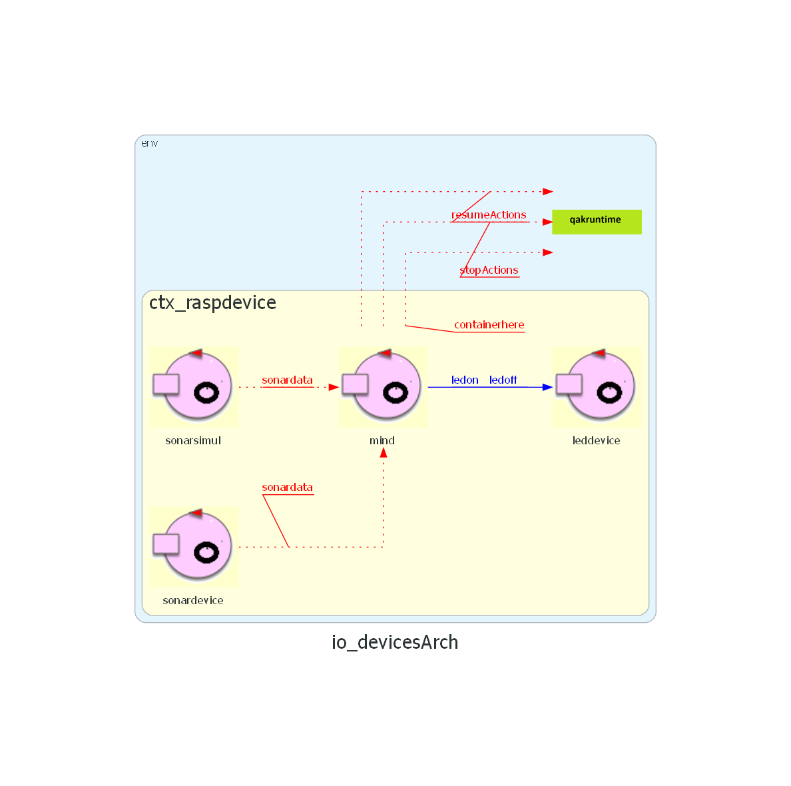
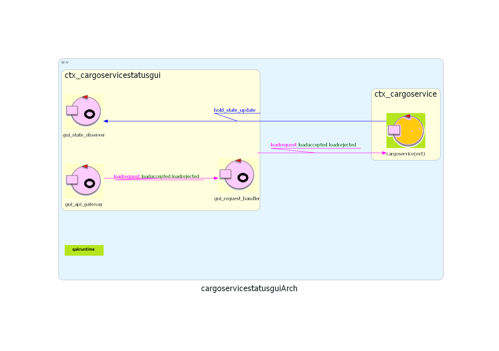

# Sprint 3

## Architettura iniziale dello sprint


## Obiettivi

Sviluppare un'interfaccia grafica e un dispositivo LED per monitorare visivamente lo stato del sistema.
In particolare i requisiti su cui ci concentreremo in questo sprint sono:

> * The ${\color{magenta}\text{slots5}}$ area is ${\color{red}\text{permanentely occupied}}$, while the other slots are initially empty
> 
> 4\. Shows the current state of the ${\color{blue}\text{hold}}$, by means of a dynamically updated ${\color{magenta}\text{web-GUI}}$.
>
> 5\. ${\color{brown}\text{Interrupts}}$ any activity and turns on a LED if the ${\color{blue}\text{sonar sensor}}$ measures a distance
>   $D > D_{FREE}$ for at least \$3\$ seconds (possibly a sonar failure).
>   The service continues its activities as soon as the sonar measures a distance $D \leq D_{FREE}$

## Analisi del Problema

### CargoServiceStatusGui

Inizialmente, nel modello di alto livello dello Sprint 0, `cargoserviceStatusGui` era stato concepito come un componente strettamente accoppiato a `cargoservice`, potenzialmente residente nello stesso contesto. Tuttavia, un'analisi più approfondita ha rivelato la necessità di un'architettura più robusta e disaccoppiata. Per questo motivo, si è deciso di implementare la GUI e il suo backend in un **contesto separato** (`ctx_cargoservicestatusgui`). Questa scelta strategica garantisce la separazione delle responsabilità (logica di business vs. logica di presentazione) e migliora la manutenibilità e la scalabilità future del sistema, trattando i due contesti come microservizi indipendenti.

Oltre al requisito originale di visualizzazione dello stato della stiva, si è aggiunto un nuovo requisito funzionale:

> La Web GUI deve permettere a un utente esterno di **inviare una richiesta di carico** (`loadrequest(PID)`) direttamente dall'interfaccia, ricevendo una notifica di successo (`loadaccepted`) o fallimento (`loadrejected`).

Questo requisito introduce una doppia responsabilità per il backend della GUI:
1.  **Flusso in uscita (Push)**: Ricevere passivamente gli aggiornamenti di stato dal `cargoservice` e inoltrarli all'interfaccia web.
2.  **Flusso in entrata (Request)**: Accettare attivamente comandi dall'interfaccia web, inoltrarli al `cargoservice` e gestire il ciclo di richiesta/risposta.

Per gestire questa duplice natura in modo pulito e aderire al **Principio di Singola Responsabilità** anche a un livello più granulare, si è deciso di suddividere il backend della GUI in **tre attori distinti**, ognuno con un compito altamente specializzato. 

Il flusso di operazioni si articola quindi come segue:

-   **`gui_api_gateway` (API Gateway)**:
    -   Agisce come unico punto di ingresso per tutte le comunicazioni provenienti dal mondo esterno (il WebSocket Handler della GUI).
    -   Nella sua fase di inizializzazione, configura un meccanismo di **delega** (`delegate`): istruisce l'infrastruttura Qak a inoltrare automaticamente tutte le future richieste di tipo `loadrequest` all'attore `gui_request_handler`.
    -   Dopo la configurazione, rimane in uno stato passivo, agendo da puro router di messaggi.

-   **`gui_state_observer` (Osservatore dello Stato)**:
    -   La sua unica responsabilità è mantenere la GUI aggiornata.
    -   In fase di inizializzazione, si sottoscrive come "osservatore" (`observeResource`) dell'attore `cargoservice`.
    -   Rimane in attesa di notifiche di aggiornamento. Quando `cargoservice` pubblica un nuovo stato della stiva, questo attore lo riceve e lo inoltra a tutti i client web connessi.

-   **`gui_request_handler` (Gestore delle Richieste)**:
    -   La sua unica responsabilità è gestire il ciclo di richiesta/risposta per i comandi inviati dalla GUI.
    -   Riceve le richieste `loadrequest` tramite la delega configurata dal Gateway.
    -   Inoltra la richiesta al `cargoservice`.
    -   Attende la risposta (`loadaccepted` o `loadrejected`) da `cargoservice`.
    -   Una volta ricevuta la risposta, la inoltra al client web originale che ha avviato la richiesta.

Questa architettura a tre attori, basata sul pattern **API Gateway** con worker specializzati, garantisce il massimo disaccoppiamento, una chiara separazione dei compiti e una notevole robustezza, poiché un eventuale malfunzionamento in un attore (es. nel gestore delle richieste) non influenzerà l'operatività degli altri (l'osservatore dello stato continuerà a funzionare).


### leddevice

```leddevice``` deve controllare il led fisico, accendendolo, in caso di malfunzionamenti segnalati da ```sonarDevice``` e spegnendolo a fine segnalazione. Essendo, dunque, un componente reattivo e proattivo lo andremo a considerare come attore.

Il flusso di ```leddevice``` è il seguente:
- in fase di inizializzazione passa direttamente all'attesa di messaggi dal sonar
- appena il sonar invia un messaggio di guasto(```ledon```) accende il led fisico
- quando il sonar riceve un messaggio di spegnimento del led lo spegne (```ledoff```)
Si sono quindi modellati altri due tipi di messaggi. Si è optato per messaggi di tipo dispatch, in quanto ```sonardevice``` non ha bisogno di una risposta da parte di ```leddevice```

```
  //Sonardevice -> leddevice
  Dispatch ledon : ledon(M)
  Dispatch ledoff : ledoff(M)
```
## Modello
L'analisi confluisce nei seguenti due modelli logici





## Piano di testing
Avendo ora un formato definito per la visualizzazione dello **stato della stiva**, è possibile verificarne con maggiore precisione il corretto aggiornamento, oltre che il corretto invio del messaggio di update per la GUI.  
A tal fine, sono stati ideati i seguenti **test plan**:

### Nuovi test aggiornamento stiva - [SlotManagementTest.java](./CargoServiceCore/src/test/java/SlotManagementTest.java)
* Verifica rappresentazione della stiva in formato JSON (caso stiva vuota):
```java
  @Test
  public void testEmptyHoldJsonRepresentation() {
      String stateJson = slotManagement.getHoldState(true);
      assertNotNull("Lo stato JSON non deve essere null", stateJson);

      try {
          JSONObject root = (JSONObject) new JSONParser().parse(stateJson);

          // Verifica totalWeight
          assertEquals("Il peso totale deve essere 0", 0, ((Long) root.get("totalWeight")).intValue());

          // Verifica slots array
          JSONArray slots = (JSONArray) root.get("slots");
          assertEquals("Devono esserci esattamente 4 slot", 4, slots.size());

          // Ogni slot deve avere product = null
          for (Object obj : slots) {
              JSONObject slotObj = (JSONObject) obj;
              assertTrue("Ogni slot deve avere un nome valido", ((String) slotObj.get("slotName")).startsWith("Slot"));
              assertNull("Ogni slot deve essere vuoto (product = null)", slotObj.get("product"));
          }

      } catch (ParseException e) {
          fail("Formato JSON non valido: " + e.getMessage());
      }
  }
```

* Verifica rappresentazione della stiva in formato JSON (caso dopo un update):
```java
  @Test
  public void testJsonStateAfterUpdate() {
      Product prod = new Product(5, "SpecialItem", 42);

      try {
          slotManagement.updateHold(prod, "Slot1");
      } catch (Exception e) {
          fail("Unexpected exception: " + e.getMessage());
      }

      String stateJson = slotManagement.getHoldState(true);
      assertNotNull("Lo stato JSON non deve essere null", stateJson);

      try {
          JSONObject root = (JSONObject) new JSONParser().parse(stateJson);

          // Verifica peso totale aggiornato
          assertEquals("Il peso totale deve riflettere il prodotto inserito",
                  42, ((Long) root.get("totalWeight")).intValue());

          // Verifica che Slot1 contenga il prodotto corretto
          JSONArray slots = (JSONArray) root.get("slots");
          JSONObject slot1 = null;
          for (Object obj : slots) {
              JSONObject slotObj = (JSONObject) obj;
              if ("Slot1".equals(slotObj.get("slotName"))) {
                  slot1 = slotObj;
                  break;
              }
          }
          assertNotNull("Slot1 deve esistere", slot1);

          JSONObject product = (JSONObject) slot1.get("product");
          assertNotNull("Slot1 deve contenere un prodotto", product);
          assertEquals(5, ((Long) product.get("productId")).intValue());
          assertEquals("SpecialItem", product.get("name"));
          assertEquals(42, ((Long) product.get("weight")).intValue());

          // Verifica che gli altri slot siano vuoti
          for (Object obj : slots) {
              JSONObject slotObj = (JSONObject) obj;
              if (!"Slot1".equals(slotObj.get("slotName"))) {
                  assertNull(slotObj.get("slotName") + " deve essere vuoto",slotObj.get("product"));
              }
          }

      } catch (ParseException e) {
          fail("Formato JSON non valido: " + e.getMessage());
      }
  }
```

### Test messaggio di update con CoAP - [CoapUpdateTest.Java](./CargoServiceCore/src/test/java/CoapUpdateTest.java)

* Verifica della ricezione del messaggio:
```java
@Test
	public void testUpdateResourceCoap() throws Exception {
		
		CoapClient client = new CoapClient("coap://localhost:8000/ctx_cargoservice/cargoservice");
		
		CountDownLatch latch = new CountDownLatch(1); //usato per impostare un timeout
		
		Logger califLogger = (Logger) LoggerFactory.getLogger("org.eclipse.californium");
		califLogger.setLevel(Level.INFO); 

		CoapObserveRelation relation = client.observe(new CoapHandler() {
			@Override
			public void onLoad(CoapResponse resp) {
				System.out.println("response: "+resp);
				String c = resp.getResponseText();
				System.out.println("content: "+c);
	            if (c != null && !c.isBlank() && !"nonews".equalsIgnoreCase(c)) {
	                content=c;
	                latch.countDown();
	            }
			}

			@Override
			public void onError() {
				latch.countDown();
			}
		});

    //mock di una loadrequest
		String req = CommUtils.buildRequest("mock", "loadrequest", "loadrequest(1)", "cargoservice").toString();

		String response = conn.request(req);
		System.out.println("richiesta inviata: "+response);

		if (!response.contains("loadaccepted"))
			fail("unexpected rejection");

    //mock dell'evento containerhere per poter testare senza preoccuparsi del sonar
		IApplMessage ev = CommUtils.buildEvent(
	            "test",              // Nome mittente
	            "containerhere",             // Nome evento
	            "containerhere(ok)"          // Contenuto
	        );
		
		conn.forward(ev);

		// Attendo la notifica CoAP con timeout per sicurezza
		boolean updated = latch.await(600, TimeUnit.SECONDS);
		relation.proactiveCancel();

		assertTrue("Nessun update CoAP ricevuto entro il timeout", updated);
		assertNotNull("Ricevuto update nullo", content);
		System.out.println("Update ricevuto: " + content);
	}
```

## Progettazione

### Leddevice

Grazie all'utilizzo del framework QAK l'implementazione di ```leddevice``` è stata banale: all'arrivo dei dispatch ```ledon``` e ```ledoff```, modellati in fase di analisi, l'attore fa partire il file python datoci dal committente per l'accensione/spegnimento del led fisico e transita nello stato successivo in attesa del messaggio complementare.

```
QActor leddevice context ctx_raspdevice{
	State init initial{
	 println("$name | led ready") color yellow
	}Goto ledoff_state
	
	State ledoff_state{
		[# Runtime.getRuntime().exec("python ./resources/python/ledPython25Off.py") #]
		println("$name | led is off") color yellow
		println("$name | led waiting for messages") color yellow
	}Transition t0 whenMsg ledon -> ledon_state
	
	State ledon_state{
		 [# machineExec("python ./resources/python/ledPython25On.py") #]
		println("$name | led is on") color yellow
	}Transition t0 whenMsg ledoff -> ledoff_state
	
}
```
### CargoserviceStatusGui

## Deployment
Poiché la parte del sistema relativa alla **logica di business** non ha subito modifiche, si rimanda allo sprint precedente per le istruzioni di [deployment di CargoServiceCore](https://github.com/sirius-22/ISS_project/blob/s3/Sprint2/Sprint2.md#deployment).  

Per quanto riguarda i componenti che gestiscono i **dispositivi di I/O**, sono disponibili due opzioni:

1. **Utilizzo su Raspberry Pi**  
   - Si possono impiegare componenti fisici per il sonar e il led.  
   - Modello QAK da utilizzare: [io_devices_rpi.qak](./IODevices/src/io_devices_rpi.qak)

2. **Utilizzo senza hardware fisico**  
   - È possibile utilizzare gli attori *mock* sviluppati negli sprint precedenti.  
   - Modello QAK da utilizzare: [io_devices.qak](./IODevices/src/io_devices.qak)


