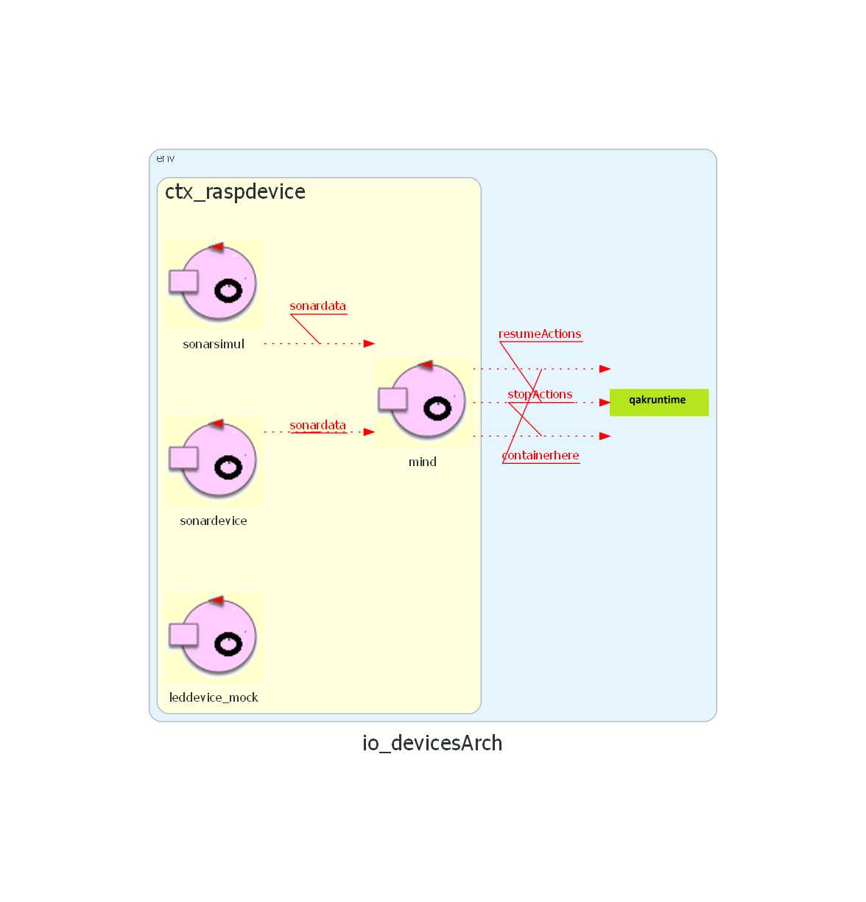
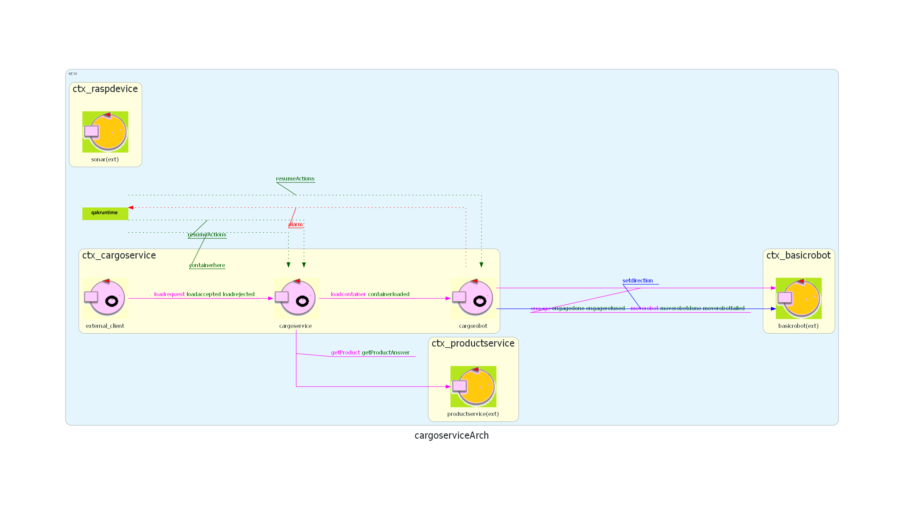

# Sprint 3

## Architettura iniziale dello sprint




## Obiettivi

Sviluppare un'interfaccia grafica e un dispositivo LED per monitorare visivamente lo stato del sistema.
In particolare i requisiti su cui ci concentreremo in questo sprint sono:

> * The ${\color{magenta}\text{slots5}}$ area is ${\color{red}\text{permanentely occupied}}$, while the other slots are initially empty
> 
> 4\. Shows the current state of the ${\color{blue}\text{hold}}$, by means of a dynamically updated ${\color{magenta}\text{web-GUI}}$.
>
> 5\. ${\color{brown}\text{Interrupts}}$ any activity and turns on a LED if the ${\color{blue}\text{sonar sensor}}$ measures a distance
>   $D > D_{FREE}$ for at least \$3\$ seconds (possibly a sonar failure).
>   The service continues its activities as soon as the sonar measures a distance $D \leq D_{FREE}$

## Analisi del Problema

### CargoServiceStatusGui

CargoserviceStatusGui riceve informazioni sullo stato della stiva da cargoService nel formato json implementato nel precedente Sprint.
Il compito di ```cargoserviceStatusGui``` è far visualizzare all'utente finale lo stato interno della stiva, visto che ```Slot5``` da requisiti è sempre vuoto non lo consideriamo nello scambio di messaggi attraverso il json, ma sarà comunque sempre prensente nalla rappresentazione.

Il flusso di ```cargoserviceStatusGui```  è il seguente:
- nella fase di inizializzazione tutti gli Slot saranno visualizzati vuoti (come da requisiti) quindi non riteniamo necessaria una prima comunicazione con cargoservice
- successivamente ```cargoserviceStatusGui``` aspetta i messaggi di update da ```cargoService``` e mostra i cambiamenti all'utente


### leddevice

```leddevice``` deve controllare il led fisico, accendendolo, in caso di malfunzionamenti segnalati da ```sonarDevice``` e spegnendolo a fine segnalazione. Essendo, dunque, un componente reattivo e proattivo lo andremo a considerare come attore.

Il flusso di ```leddevice``` è il seguente:
- in fase di inizializzazione passa direttamente all'attesa di messaggi dal sonar
- appena il sonar invia un messaggio di guasto(```ledon```) accende il led fisico
- quando il sonar riceve un messaggio di spegnimento del led lo spegne (```ledoff```)
Si sono quindi modellati altri due tipi di messaggi. Si è optato per messaggi di tipo dispatch, in quanto ```sonardevice``` non ha bisogno di una risposta da parte di ```leddevice```

```
  //Sonardevice -> leddevice
  Dispatch ledon : ledon(M)
  Dispatch ledoff : ledoff(M)
```

## Piano di testing

## Progettazione

## Deployment
Poiché la parte del sistema relativa alla **logica di business** non ha subito modifiche, si rimanda allo sprint precedente per le istruzioni di [deployment di CargoServiceCore](https://github.com/sirius-22/ISS_project/blob/s3/Sprint2/Sprint2.md#deployment).  

Per quanto riguarda i componenti che gestiscono i **dispositivi di I/O**, sono disponibili due opzioni:

1. **Utilizzo su Raspberry Pi**  
   - Si possono impiegare componenti fisici per il sonar e il led.  
   - Modello QAK da utilizzare: [io_devices_rpi.qak](./IODevices/src/io_devices_rpi.qak)

2. **Utilizzo senza hardware fisico**  
   - È possibile utilizzare gli attori *mock* sviluppati negli sprint precedenti.  
   - Modello QAK da utilizzare: [io_devices.qak](./IODevices/src/io_devices.qak)


