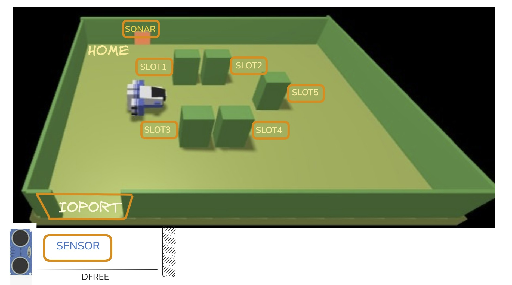

## 

A _Maritime Cargo shipping company_ (from now on, simply ${\color{blue}\text{company}}$) intends to automate the operations of load of freight in the ship’s cargo hold (or simply ${\color{blue}\text{hold}}$). To this end, the company plans to employ a Differential Drive Robot (from now, called ${\color{blue}\text{cargorobot}}$) for the loading of goods (named ${\color{blue}\text{products}}$) in the ship’s hold.

The products to be loaded must be placed in a container of predefined dimensions and registered, by specifying its weight, within a database, by using a proper service (${\color{blue}\text{productservice}}$). After the registration, the _productservice_ returns a **unique product identifier** as a natural number  ${\color{blue}\texttt{PID, PID>0}}$.

The hold is a rectangular, flat area with an Input/Output port (${\color{blue}\text{IOPort}}$). The area provides  ${\color{blue}\texttt{4 slots}}$ for the product containers.

In the picture above:

* The ${\color{magenta}\text{slots}}$ depict the hold storage areas, when they are ocuupied by product containes

* The ${\color{magenta}\text{slots5}}$ area is ${\color{red}\text{permanentely occupied}}$, while the other slots are initially empty

* The ${\color{magenta}\text{sensor}}$ put in front of the ${\color{blue}\text{IOPort}}$ is a sonar used to detect the presence of a product container, when it measures a distance  ${\color{blue}\texttt{D}}$, such that  ${\color{blue}\texttt{D < DFREE/2}}$, during a reasonable time (e.g.  ${\color{blue}\texttt{3}}$ secs).

## TF2025 Requirements

The company asks us to build a software system (named ${\color{blue}\text{cargoservice}}$) that:

1. **Receives a request to load** on the cargo a product container already registered in the ${\color{blue}\text{productservice}}$.

   The request is rejected when:

   * the product weight is evaluated too high, since the ship can carry a maximum load of
     ${\color{blue}\texttt{MaxLoad > 0 kg}}$
   * the hold is already full, i.e., the
     ${\color{lightblue}\texttt{4 slots}}$ are already occupied.

   If the request is accepted, the ${\color{blue}\text{cargoservice}}$ associates a slot to the product
   ${\color{blue}\texttt{PID}}$ and returns the name of the reserved slot.
   Afterwards, it waits for the product container to be delivered to the ${\color{blue}\text{ioport}}$.
   In the meantime, other requests are not elaborated.

2. Detects (by means of the ${\color{blue}\text{sonar}}$ ${\color{magenta}\text{sensor}}$) the presence of the product container at the ${\color{blue}\text{ioport}}$.

3. Ensures that the product container is placed by the ${\color{blue}\text{cargorobot}}$ within its reserved slot.
   At the end of the operation:

   * the ${\color{blue}\text{cargorobot}}$ should return to its ${\color{brown}\text{HOME}}$ location;
   * the ${\color{blue}\text{cargoservice}}$ can process another *load-request*.

4. Shows the current state of the ${\color{blue}\text{hold}}$, by means of a dynamically updated ${\color{magenta}\text{web-GUI}}$.

5. ${\color{brown}\text{Interrupts}}$ any activity and turns on a LED if the ${\color{blue}\text{sonar sensor}}$ measures a distance
   $D > D_{FREE}$
   for at least \$3\$ seconds (possibly a sonar failure).
   The service continues its activities as soon as the sonar measures a distance
   $D \leq D_{FREE}$

